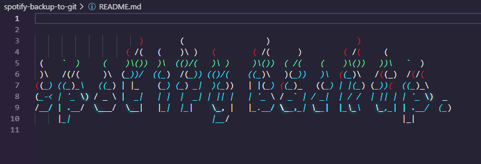

The idea for this was too have a automated system in place that runs 100% and automatically scraps spotify via its api for my user's account for my playlists, and let it run automatically every couple hours and always have a cold backup of all my playlists because spotify could go down under for whatever reason and my memory is so bad i would never remember 99% of the artists so feel free to clone the setup and use it.

