I've added the functionality to also save liked songs, by default spotify looks at the liked songs differently than playlist so i wrote a different function to utilize "user-library-read" auth scope to read the liked songs and save the output as .json. Just like playlists that is saved in /playlists, liked songs are saved in /liked_songs directory. 

the idea for this was to have a system in place that automatically scrap spotify api for my user's account for my playlist, and let it run automatically everyday and always have a cold backup of all my playlists because spotify could go down under for whatever reason and my memory is so bad i would never remember 99% of the artists so feel free to clone the setup and use it. ill write more on what why i chose to do it this way maybe some day.

